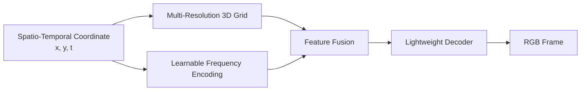

# Hybrid Grid — Neural Video Representation

**Paper:** *A Hybrid Grid-Based Method for Video Representation* · **ICASSP 2026**

**技术栈：** PyTorch · Implicit Neural Representation · Multi-Resolution Grid · Positional Encoding · Video Representation

面向神经视频表示任务，探索 **显式多分辨率网格与轻量神经网络结合** 的 Hybrid Representation。模型以时空坐标 `(x, y, t)` 为输入，通过多尺度 3D Grid 提取局部时空特征，并结合可学习频率位置编码补充连续坐标信息，在保持表示质量的同时降低解码网络复杂度。

[论文 PDF](paper.pdf)

---

## Architecture



核心思路是将视频表示能力拆分到两类互补特征中：

- **Multi-Resolution Grid：** 在不同空间与时间尺度上存储可学习特征，通过三线性插值得到连续坐标对应的局部表示。
- **Learnable Frequency Encoding：** 对 `(x, y, t)` 进行多频率正余弦编码，并将频率参数加入训练，用于补充连续位置与高频细节信息。
- **Lightweight Decoder：** 将 Grid Feature 与 Positional Feature 融合后映射到 RGB，避免将全部视频信息压入大型 MLP。

---

## Core Features

### Multi-Resolution Grid Representation

- 构建多层可学习 3D Grid，每层具有不同空间 / 时间分辨率，形成 coarse-to-fine 的时空表示。
- 根据视频宽高比动态设置 `x / y` 网格分辨率，并通过 `time_scale` 控制时间维度容量。
- 对每个 `(x, y, t)` 坐标查询 8 个邻近顶点，使用三线性插值得到连续 Grid Feature。

### Learnable Positional Encoding

- 使用多频率 `sin / cos` 编码增强连续坐标表达能力。
- 频率参数可参与训练，使位置编码能够根据视频内容自适应调整，而不是固定使用预设频率。
- 将显式 Grid 的局部特征与频率编码的连续位置特征结合，形成 Hybrid Representation。

### Training & Evaluation

- 使用 PyTorch 完成坐标生成、视频帧采样、模型训练、Checkpoint 与 TensorBoard 日志链路。
- 支持固定分辨率与动态分辨率训练，并可配置 frame interval、grid levels、feature dimension 与 resolution range。
- 评测阶段统计 **PSNR、MS-SSIM 与 FPS**，同时支持重建帧导出与独立 Eval-only 流程。

### Experimental Extensions

当前仓库同时保留了论文工作之后的若干实验性探索，用于进一步研究表示质量与解码效率之间的权衡：

- Gated feature fusion
- Spatio-temporal feature modulation
- Residual CNN refinement decoder

这些模块属于后续实验方向，论文核心方法以 [`paper.pdf`](paper.pdf) 为准。

---

## Paper

**A Hybrid Grid-Based Method for Video Representation**  
Miaoran Zhao, Mufan Liu, Wenjie Huang, Puyue Hou, Yiling Xu  
Shanghai Jiao Tong University  
**IEEE ICASSP 2026 — Image and Video Representation**

论文研究显式 Grid Representation 与神经隐式表示的结合，通过多分辨率时空网格承担主要视频内容表示，并使用轻量网络完成连续坐标到像素值的映射。

---

## Evaluation

仓库训练与评测流程主要关注以下指标：

| Metric | Purpose |
| --- | --- |
| PSNR | 衡量视频帧重建质量 |
| MS-SSIM | 衡量多尺度结构相似性 |
| FPS | 衡量模型解码速度 |
| Parameters | 衡量模型表示与存储开销 |

论文中的完整实验设置、对比方法与结果请参阅 [`paper.pdf`](paper.pdf)。

---

## Key Modules

| Module | Responsibility |
| --- | --- |
| `encoding.py` | Multi-Resolution Grid、三线性插值与可学习 Frequency Encoding |
| `model.py` | Dataset、HybridGridNet、Feature Fusion 与 Decoder |
| `train.py` | 训练、Checkpoint、验证、PSNR / MS-SSIM / FPS 评测 |
| `util.py` | Loss、Metric 与训练辅助函数 |
| `paper.pdf` | ICASSP 2026 论文 |

---

## Quick Start

准备连续视频帧，并将帧目录传给 `--data_root`：

```bash
python train.py \
  --data_root ./data/bunny \
  --fixed_res 720 1280 \
  --epochs 1200
```

常用模型参数：

```text
--grid_levels
--grid_feat_dim
--base_resolution
--finest_resolution
--time_scale
--pe_freq
--hidden_dim
```

独立评测：

```bash
python train.py \
  --data_root ./data/bunny \
  --resume <checkpoint_path> \
  --eval_only
```

---

## Project Structure

```text
hybrid_grid/
├── encoding.py       # Grid / Frequency Encoding
├── model.py          # Hybrid Grid Network
├── train.py          # Training & Evaluation
├── util.py           # Loss / Metrics / Utils
├── data/             # Example video frames
└── paper.pdf         # ICASSP 2026 Paper
```
