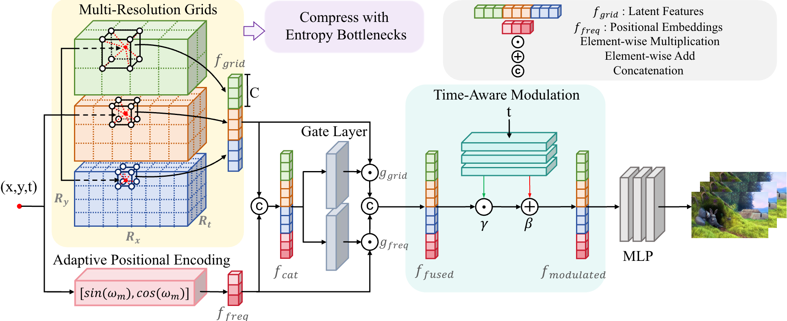
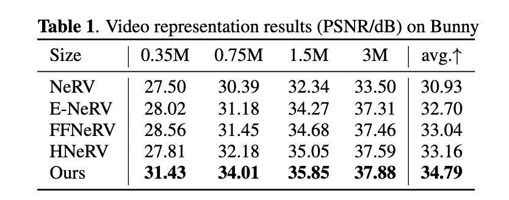
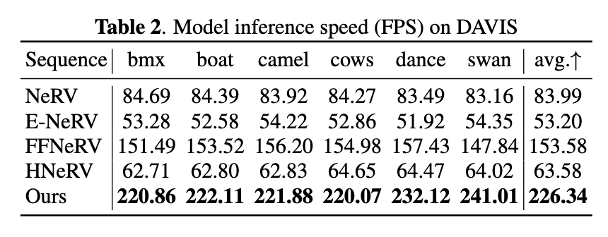
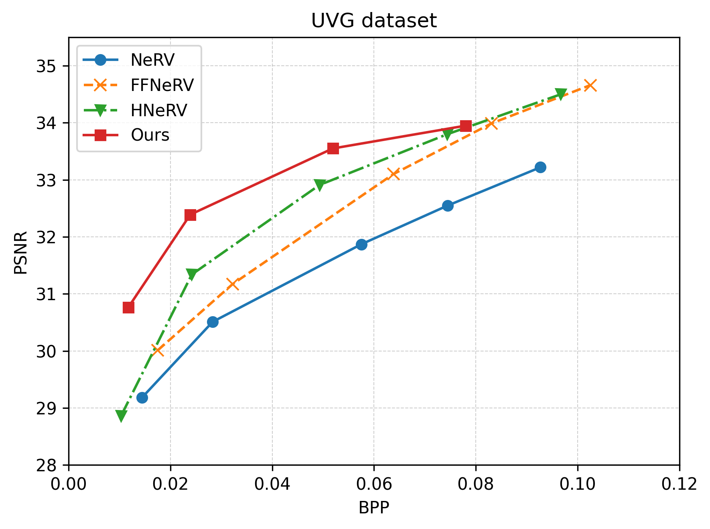
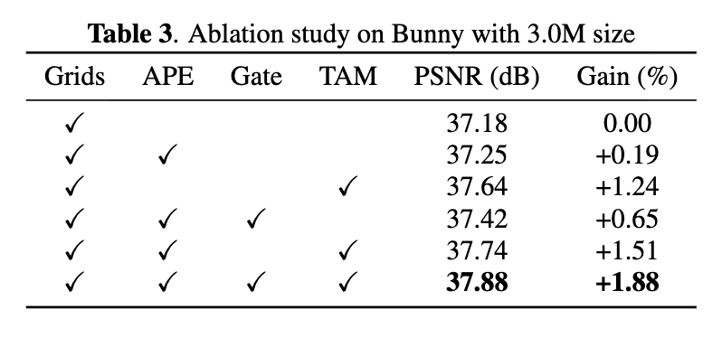
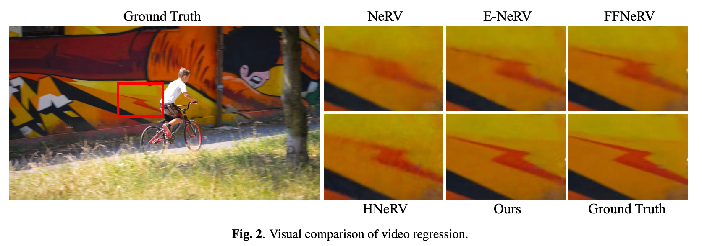

# Hybrid Grid — Neural Video Representation

**Paper:** [*A Hybrid Grid-Based Method for Video Representation*](https://ieeexplore.ieee.org/document/11463942) · **ICASSP 2026**

**技术栈：** PyTorch · Implicit Neural Representation · Multi-Resolution Grid · Adaptive Positional Encoding · Video Representation

面向神经视频表示任务，构建 **显式多分辨率时空网格 + 轻量神经网络** 的 Hybrid Representation。模型以时空坐标 `(x, y, t)` 为输入，通过 Multi-Resolution Grids 提取局部时空特征，并结合 Adaptive Positional Encoding、Gate Layer 与 Time-Aware Modulation 提升连续坐标建模能力，在重建质量、压缩效率与解码速度之间取得更好的平衡。

---

## Architecture

<p align="center">
  
</p>

整体方法包含四个核心模块：

- **Multi-Resolution Grids：** 在不同空间 / 时间尺度上存储可学习 latent features，并通过三线性插值查询连续坐标对应的局部表示。
- **Adaptive Positional Encoding (APE)：** 对 `(x, y, t)` 进行自适应频率编码，补充连续坐标与高频细节信息。
- **Gate Layer：** 对 Grid Features 与 Positional Embeddings 进行自适应加权融合。
- **Time-Aware Modulation (TAM)：** 根据时间信息生成调制参数，对融合特征进行动态调整后交由轻量 MLP 解码为 RGB 帧。

仓库只保留论文使用的模型结构：可学习位置编码以 `2^m` 初始化，TAM 仅由时间坐标驱动，Decoder 为纯 MLP，不包含后续尝试中的 CNN refine 或逐像素时空调制。

论文同时采用 entropy bottlenecks 对 grid latent features 进行压缩，以支持码率控制与率失真评测。

---

## Core Features

### Multi-Resolution Grid Representation

- 构建多层可学习 3D Grid，形成 coarse-to-fine 的时空表示。
- 根据视频宽高比与时间尺度设置网格分辨率，并通过 `time_scale` 控制时间维度容量。
- 对每个 `(x, y, t)` 坐标查询 8 个邻近顶点，使用三线性插值得到连续 Grid Feature。

### Adaptive Positional Encoding

- 使用多频率 `sin / cos` 编码增强连续坐标表达能力。
- 频率参数参与训练，使位置编码能够根据视频内容自适应调整。
- 与显式 Grid 的局部特征互补，共同构成 Hybrid Representation。

### Gated Fusion & Time-Aware Modulation

- Gate Layer 分别生成 Grid 与 Positional Feature 的门控权重，实现自适应特征融合。
- TAM 使用时间信息调制融合后的表示，使模型能够更好地建模视频帧间动态变化。
- 最终通过轻量 MLP 完成从时空特征到 RGB 像素值的映射。

### Training & Evaluation

- 使用 PyTorch 完成坐标生成、视频帧采样、模型训练、Checkpoint 与 TensorBoard 日志链路。
- 支持固定分辨率与动态分辨率训练，可配置 frame interval、grid levels、feature dimension 与 resolution range。
- 评测阶段统计 **PSNR、MS-SSIM 与 FPS**，并支持重建帧导出与独立 Eval-only 流程。

---

## Results

### Video Representation Quality

<p align="center">
  
</p>

在 Bunny 序列上，Ours 在 **0.35M / 0.75M / 1.5M / 3M** 四个模型规模下均取得最高 PSNR，平均达到 **34.79 dB**；在 3M 设置下达到 **37.88 dB**。

### Inference Speed

<p align="center">
  
</p>

在 DAVIS 六个序列上，Ours 的平均推理速度达到 **226.34 FPS**，高于 NeRV、E-NeRV、FFNeRV 与 HNeRV。

### Rate-Distortion Performance

<p align="center">
  
</p>

在 UVG 数据集上，Hybrid Grid 在低到中等码率区间呈现更优的 **PSNR–BPP** 权衡，体现了显式 Grid 表示与压缩机制在质量和码率之间的优势。

---

## Ablation Study

<p align="center">
  
</p>

以 3.0M 模型规模为例，基础 Grids 得到 **37.18 dB**；加入 APE、Gate 与 TAM 后，完整模型达到 **37.88 dB**，表中对应总增益为 **+1.88%**。消融结果表明三个模块均对最终性能有贡献，其中 TAM 带来的提升较为明显。

---

## Qualitative Results

<p align="center">
  
</p>

可视化结果对比 Ground Truth、NeRV、E-NeRV、FFNeRV、HNeRV 与 Ours。局部放大区域显示，Ours 能更完整地恢复边缘与高频纹理细节。

---

## Paper

**A Hybrid Grid-Based Method for Video Representation**  
Miaoran Zhao, Mufan Liu, Wenjie Huang, Puyue Hou, Yiling Xu  
Shanghai Jiao Tong University  
**IEEE ICASSP 2026 — Image and Video Representation**

[IEEE Xplore](https://ieeexplore.ieee.org/document/11463942) · DOI: `10.1109/ICASSP55912.2026.11463942`

---

## Key Modules

| Module | Responsibility |
| --- | --- |
| `encoding.py` | Multi-Resolution Grid、三线性插值与 Frequency Encoding |
| `model.py` | Dataset、HybridGridNet、Feature Fusion、Modulation 与 Decoder |
| `train.py` | 训练、Checkpoint、验证、PSNR / MS-SSIM / FPS 评测 |
| `util.py` | Loss、Metric 与训练辅助函数 |
| `assets/figures/` | 论文架构图、定量结果与可视化结果 |

---

## Quick Start

准备连续视频帧，并将帧目录传给 `--data_root`：

```bash
python train.py \
  --data_root ./data/bunny \
  --fixed_res 720 1280 \
  --epochs 1200
```

常用模型参数：

```text
--grid_levels
--grid_feat_dim
--base_resolution
--finest_resolution
--time_scale
--pe_freq
--hidden_dim
```

独立评测：

```bash
python train.py \
  --data_root ./data/bunny \
  --resume <checkpoint_path> \
  --eval_only
```

---

## Project Structure

```text
hybrid_grid/
├── assets/figures/    # Paper figures and results
├── encoding.py        # Grid / Frequency Encoding
├── model.py           # Hybrid Grid Network
├── train.py           # Training & Evaluation
├── util.py            # Loss / Metrics / Utils
└── data/              # Example video frames
```
